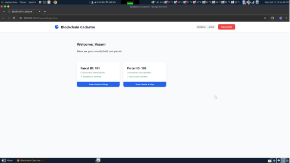
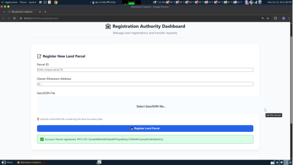
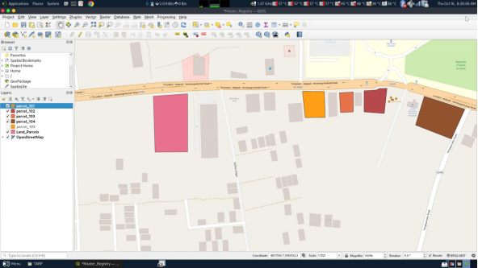

# 🏛️ Blockchain-Based Cadastral System with Zero-Knowledge Proofs

> **A novel integration of Blockchain, GIS (Geographic Information Systems), and Zero-Knowledge Proofs for secure, private, and verifiable land ownership management.**

The initial spark to make this project came from the difficulties with the current land registration systems, where numerous flaws and disputes occur daily. The core innovation is **combining the transparency of blockchain with GIS technology** (storing actual land parcel geometries) while preserving privacy through **Zero-Knowledge Proofs**. 

This project successfully demonstrates how these three major technologies—**Blockchain**, **GIS**, and **ZKP**—can work together to create a more secure and privacy-preserving cadastral system.

> ⚠️ **Note**: This is a Proof of Concept. The ZKP implementation is simplified for demonstration purposes. Production-grade zk-SNARK circuit implementations would require significantly more computational resources and time for proof generation/verification.

---

## 📋 Table of Contents

- Overview
- Key Features
- System Architecture
- Technology Stack
- Prerequisites
- Installation & Setup
- Running the Application
- API Documentation
- Zero-Knowledge Proof System
- Database Schema
- Smart Contract
- Security Features
- Troubleshooting
- Project Structure
- Contributing
- License

---

## 🎯 Overview

This system revolutionizes land registration by:
- **Storing ownership commitments on blockchain** - Immutable, transparent records
- **Encrypting sensitive data on IPFS** - Decentralized storage for land boundaries
- **Using Zero-Knowledge Proofs** - Prove ownership without revealing sensitive information
- **Providing selective disclosure** - Share ownership proof with specific parties only

### Real-World Use Cases

1. **🏦 Bank Loan Applications** - Prove land ownership to banks without revealing other holdings
2. **🏘️ Property Sales** - Verify seller ownership before purchase
3. **📊 Government Tax Assessment** - Verify individual parcels without accessing complete portfolio
4. **⚖️ Legal Disputes** - Cryptographically verifiable ownership claims

---

## ✨ Key Features

### 🔐 Privacy-Preserving Architecture
- **Commitment-Based Registration**: Only cryptographic hashes stored on blockchain
- **Selective Disclosure**: Choose what to reveal and to whom
- **Unlinkability**: Individual parcel proofs cannot be linked together

### 🔗 Blockchain Integration
- **Ethereum Smart Contracts**: Immutable ownership records
- **Event Logging**: Complete audit trail of all transactions
- **Gas Optimization**: Efficient contract design

### 📦 Decentralized Storage
- **IPFS Integration**: Land boundary GeoJSON files stored on IPFS
- **Pinata Service**: Reliable IPFS pinning
- **Encrypted Metadata**: Additional security layer

### 🎭 Zero-Knowledge Proof System
- **Public Proofs**: Shareable with anyone
- **Verifier-Bound Proofs**: Restricted to specific addresses
- **Tamper Detection**: Cryptographic integrity verification
- **Expiration**: Time-limited proofs (24 hours)

### 🗺️ Interactive Map Interface
- **Leaflet.js Maps**: Visualize land parcels
- **GeoJSON Support**: Industry-standard format
- **Boundary Drawing**: Create parcels directly on map

---

## 🏗️ System Architecture

```
┌─────────────────────────────────────────────────────────────┐
│                        Frontend (HTML/Vanilla JS)           │
│  ┌──────────────┐  ┌──────────────┐  ┌──────────────┐       │
│  │   Login      │  │   Dashboard  │  │   Map View   │       │
│  │   MetaMask   │  │   My Parcels │  │   GeoJSON    │       │
│  └──────────────┘  └──────────────┘  └──────────────┘       │
└────────────────────────┬────────────────────────────────────┘
                         │ HTTPS / REST API
┌────────────────────────▼────────────────────────────────────┐
│                    Backend (Node.js + Express)              │
│  ┌──────────────┐  ┌──────────────┐  ┌──────────────┐       │
│  │     Auth     │  │     ZK       │  │    IPFS      │       │
│  │   JWT/Web3   │  │   Proofs     │  │   Pinata     │       │
│  └──────────────┘  └──────────────┘  └──────────────┘       │
└────────┬──────────────────┬─────────────────┬───────────────┘
         │                  │                 │
         ▼                  ▼                 ▼
┌────────────────┐  ┌──────────────┐  ┌──────────────┐
│   PostgreSQL   │  │   Ethereum   │  │     IPFS     │
│   (Secrets)    │  │  (Ganache)   │  │  (Pinata)    │
└────────────────┘  └──────────────┘  └──────────────┘
```

## Snapshots








### Data Flow

1. **Registration**:
   ```
   User → Upload GeoJSON → IPFS (get CID)
   → Generate Commitment = hash(owner + parcelId + salt)
   → Store Commitment on Blockchain
   → Store Salt + CID in Database
   ```

2. **Verification**:
   ```
   User → Generate ZK Proof (using salt + parcelId)
   → Verifier checks Proof + Blockchain Commitment
   → Ownership Verified (without revealing salt)
   ```

---

## 🛠️ Technology Stack

### Frontend
- **HTML5/CSS3/JavaScript** - Core web technologies
- **Leaflet.js** - Interactive maps
- **Leaflet.draw** - Map drawing tools
- **ethers.js** - Ethereum interaction
- **MetaMask** - Wallet integration

### Backend
- **Node.js v18+** - Runtime environment
- **Express.js** - Web framework
- **ethers.js v6** - Ethereum library
- **PostgreSQL** - Relational database
- **JWT** - Authentication tokens
- **Axios** - HTTP client

### Blockchain
- **Solidity ^0.8.0** - Smart contract language
- **Truffle Suite** - Development framework
- **Ganache** - Local blockchain
- **OpenZeppelin** - Security libraries

### Storage
- **IPFS** - Decentralized storage
- **Pinata** - IPFS pinning service

### Cryptography
- **Keccak256** - Hashing algorithm
- **ECDSA** - Signature verification
- **Commitment Schemes** - Privacy preservation

---

## 📦 Prerequisites

### Required Software

| Software | Version | Download |
|----------|---------|----------|
| Node.js | v18+ | [nodejs.org](https://nodejs.org/) |
| npm | v9+ | Included with Node.js |
| PostgreSQL | v14+ | [postgresql.org](https://www.postgresql.org/) |
| Ganache | v7+ | [trufflesuite.com](https://trufflesuite.com/ganache/) |
| Truffle | v5+ | `npm install -g truffle` |
| MetaMask | Latest | [metamask.io](https://metamask.io/) |

### System Requirements
- **OS**: Linux, macOS, or Windows 10+
- **RAM**: 4GB minimum, 8GB recommended
- **Storage**: 10GB free space
- **Network**: Stable internet connection for IPFS

---

## 🚀 Installation & Setup

### Step 1: Clone Repository

```bash
git clone <repository-url>
cd blockchain-based-cadastral-system-main
```

### Step 2: Install Dependencies

#### Frontend Dependencies
```bash
cd frontend
npm install
# Or if no package.json, dependencies are loaded via CDN in HTML
cd ..
```

#### Backend Dependencies
```bash
cd backend
npm install
cd ..
```

#### Blockchain Dependencies
```bash
cd blockchain
npm install
cd ..
```

### Step 3: PostgreSQL Database Setup

#### Create Database
```bash
# Access PostgreSQL
sudo -u postgres psql

# Create database
CREATE DATABASE cadastral_system;

# Create user
CREATE USER cadastre_user WITH PASSWORD 'your_secure_password';

# Grant privileges
GRANT ALL PRIVILEGES ON DATABASE cadastral_system TO cadastre_user;

# Exit
\q
```

#### Run Database Schema
```bash
cd backend
psql -U cadastre_user -d cadastral_system -f schema.sql
```

#### Database Schema Tables

```sql
-- Users table
CREATE TABLE users (
    wallet_address VARCHAR(42) PRIMARY KEY,
    name VARCHAR(100),
    email VARCHAR(100),
    mobile_number VARCHAR(15),
    aadhar_number VARCHAR(12),
    physical_address TEXT,
    is_authority BOOLEAN DEFAULT FALSE,
    created_at TIMESTAMP DEFAULT NOW()
);

-- User secrets table (encrypted data)
CREATE TABLE user_secrets (
    id SERIAL PRIMARY KEY,
    owner_address VARCHAR(42) NOT NULL,
    parcel_id INTEGER UNIQUE NOT NULL,
    commitment_hash VARCHAR(66) NOT NULL,
    ipfs_cid_encrypted TEXT NOT NULL,
    salt_encrypted VARCHAR(66) NOT NULL,
    created_at TIMESTAMP DEFAULT NOW(),
    FOREIGN KEY (owner_address) REFERENCES users(wallet_address)
);

-- Transfer requests table
CREATE TABLE transfer_requests (
    request_id SERIAL PRIMARY KEY,
    parcel_id INTEGER NOT NULL,
    from_address VARCHAR(42) NOT NULL,
    to_address VARCHAR(42) NOT NULL,
    reason TEXT,
    status VARCHAR(20) DEFAULT 'pending',
    created_at TIMESTAMP DEFAULT NOW(),
    approved_at TIMESTAMP
);

-- Proof verifications audit log
CREATE TABLE proof_verifications (
    id SERIAL PRIMARY KEY,
    parcel_id INTEGER NOT NULL,
    prover_address VARCHAR(42) NOT NULL,
    verifier_ip VARCHAR(45),
    verification_result JSONB,
    verified_at TIMESTAMP DEFAULT NOW()
);
```

### Step 4: Configure Environment Variables

Create .env:

```env
# Database Configuration
DB_USER=cadastre_user
DB_HOST=localhost
DB_DATABASE=cadastral_system
DB_PASSWORD=your_secure_password
DB_PORT=5432

# JWT Configuration
JWT_SECRET=your-256-bit-secret-key-here-generate-with-openssl

# Blockchain Configuration
GANACHE_RPC_URL=http://127.0.0.1:8545
CONTRACT_ADDRESS=<will-be-set-after-deployment>
REGISTRATION_AUTHORITY_PRIVATE_KEY=<ganache-account-private-key>

# IPFS Configuration (Pinata)
PINATA_JWT=your-pinata-jwt-token

# ZK Configuration
ZK_SETUP=true
ZK_BUILD_PATH=./circuits/build

# Server Configuration
PORT=4000
NODE_ENV=development
```

#### Generate JWT Secret
```bash
openssl rand -hex 64
```

#### Get Pinata JWT
1. Sign up at [pinata.cloud](https://pinata.cloud)
2. Go to API Keys
3. Generate new JWT token
4. Copy and paste into `.env`

### Step 5: Start Ganache

#### Using Ganache GUI
1. Open Ganache application
2. Create new workspace or quickstart
3. Note the RPC URL (usually `http://127.0.0.1:8545`)
4. Copy any account's private key for `REGISTRATION_AUTHORITY_PRIVATE_KEY`

#### Using Ganache CLI
```bash
ganache-cli --networkId 1337 --port 8545 --accounts 10 --defaultBalanceEther 1000
```

### Step 6: Deploy Smart Contract

```bash
cd blockchain

# Compile contracts
truffle compile

# Deploy to Ganache
truffle migrate --network development

# Note the deployed contract address
# Copy "contract address" from output
```

#### Update `.env` with Contract Address
```env
CONTRACT_ADDRESS=0x... # Paste the deployed address here
```

### Step 7: Configure MetaMask

1. **Open MetaMask** browser extension
2. **Add Network**:
   - Network Name: `Ganache Local`
   - RPC URL: `http://127.0.0.1:8545`
   - Chain ID: `1337`
   - Currency Symbol: `ETH`

3. **Import Account**:
   - Copy private key from Ganache
   - Import into MetaMask
   - You should see 1000 ETH balance

### Step 8: Initialize Database with Authority Account

```bash
cd backend

# Create a script to insert authority account
node -e "
const pg = require('pg');
const pool = new pg.Pool({
  user: 'cadastre_user',
  host: 'localhost',
  database: 'cadastral_system',
  password: 'your_secure_password',
  port: 5432
});

pool.query(
  'INSERT INTO users (wallet_address, name, email, is_authority) VALUES (\$1, \$2, \$3, \$4)',
  ['<your-metamask-address>', 'Registration Authority', 'admin@cadastre.gov', true]
).then(() => {
  console.log('Authority account created');
  pool.end();
});
"
```

---

## 🎮 Running the Application

### Start Backend Server

```bash
cd backend
npm start
# Server should start on http://localhost:4000
```

**Expected Output**:
```
Connected to LandRegistry contract at: 0x...
🔄 Initializing ZK system...
✅ ZK system ready for proof generation
Server running on port 4000
```

### Start Frontend

#### Option 1: Using Live Server (Recommended)
```bash
cd frontend
# Install live-server globally if not already
npm install -g live-server

# Start server
live-server --port=3000
```

#### Option 2: Using Python
```bash
cd frontend
python3 -m http.server 3000
```

#### Option 3: Using Node.js http-server
```bash
npm install -g http-server
cd frontend
http-server -p 3000
```

**Access Application**: Open browser to `http://localhost:3000`

---

## 🎯 Using the Application

### 1️⃣ Registration Authority Login

1. **Open Application** (`http://localhost:3000`)
2. **Connect MetaMask**
   - Click "Connect Wallet"
   - Select your imported Ganache account
   - Sign the authentication message
3. **Verify Authority Status**
   - You should see "Registration Authority" label
   - Access to "Register New Parcel" option

### 2️⃣ Register a Land Parcel

1. **Navigate to Register Parcel**
2. **Enter Parcel Details**:
   - Parcel ID: `101`
   - Owner Address: `0x...` (any Ganache account)
3. **Draw Land Boundaries**:
   - Use map drawing tools
   - Create a polygon for the parcel
   - Ensure valid GeoJSON format
4. **Submit Registration**
   - Transaction sent to blockchain
   - GeoJSON uploaded to IPFS
   - Cryptographic commitment generated
   - Success message displayed

**Process Flow**:
```
Drawing Polygon → Upload to IPFS → Generate Commitment
→ Blockchain Transaction → Database Storage → Confirmation
```

### 3️⃣ Regular User Login

1. **Import Another Ganache Account** to MetaMask
2. **Register User**:
   ```javascript
   POST /api/users
   {
     "wallet_address": "0x...",
     "name": "John Doe",
     "email": "john@example.com",
     "mobile_number": "1234567890",
     "aadhar_number": "123456789012",
     "physical_address": "123 Main St"
   }
   ```
3. **Login via MetaMask**
4. **View Your Parcels** in dashboard

### 4️⃣ Generate Zero-Knowledge Proof

#### Public Proof (Anyone Can Verify)
```javascript
// Frontend JavaScript
async function generatePublicProof(parcelId) {
    const response = await fetch('http://localhost:4000/api/zk/generate-shareable-proof', {
        method: 'POST',
        headers: {
            'Content-Type': 'application/json',
            'Authorization': `Bearer ${sessionToken}`
        },
        body: JSON.stringify({
            parcelId: parcelId,
            message: "Public ownership verification"
            // No verifierAddress = public proof
        })
    });
    
    const { shareableProof } = await response.json();
    console.log('Proof:', JSON.stringify(shareableProof, null, 2));
}
```

#### Private Proof (Specific Verifier)
```javascript
async function generatePrivateProof(parcelId, bankAddress) {
    const response = await fetch('http://localhost:4000/api/zk/generate-shareable-proof', {
        method: 'POST',
        headers: {
            'Content-Type': 'application/json',
            'Authorization': `Bearer ${sessionToken}`
        },
        body: JSON.stringify({
            parcelId: parcelId,
            verifierAddress: bankAddress, // Bound to specific address
            message: "Proof for mortgage application"
        })
    });
    
    const { shareableProof } = await response.json();
    // Only bankAddress can verify this proof
}
```

### 5️⃣ Verify Ownership Proof

```javascript
async function verifyProof(shareableProof) {
    const response = await fetch('http://localhost:4000/api/zk/verify-shareable-proof', {
        method: 'POST',
        headers: {
            'Content-Type': 'application/json'
        },
        body: JSON.stringify({ shareableProof })
    });
    
    const result = await response.json();
    /*
    {
      "proofValid": true,
      "zkProofValid": true,
      "blockchainVerified": true,
      "status": "OWNERSHIP_VERIFIED",
      "parcelId": "101",
      "prover": "0x...",
      "verifiedAt": "2025-11-05T12:00:00.000Z"
    }
    */
}
```

---

## 📡 API Documentation

### Authentication Endpoints

#### `POST /api/auth/challenge`
Generate authentication challenge message

**Request**:
```json
{
  "address": "0x742d35Cc6634C0532925a3b844Bc9e7595f0bEb"
}
```

**Response**:
```json
{
  "message": "Welcome to the Cadastre Platform!\nPlease sign this message to log in.\n\nNonce: 123456"
}
```

#### `POST /api/auth/login`
Authenticate with signed message

**Request**:
```json
{
  "address": "0x742d35Cc6634C0532925a3b844Bc9e7595f0bEb",
  "signature": "0x..."
}
```

**Response**:
```json
{
  "token": "eyJhbGciOiJIUzI1NiIsInR5cCI6IkpXVCJ9..."
}
```

### Parcel Management

#### `GET /api/my-parcels`
Get user's registered parcels

**Headers**: `Authorization: Bearer <token>`

**Response**:
```json
[
  {
    "parcel_id": 101,
    "commitment_hash": "0xabc123...",
    "ipfs_cid": "Qm...",
    "created_at": "2025-11-05T10:00:00.000Z",
    "blockchain_verified": true
  }
]
```

#### `POST /api/parcels/register`
Register new land parcel (Authority only)

**Headers**: `Authorization: Bearer <token>`

**Request**:
```json
{
  "parcelId": 101,
  "ownerAddress": "0x...",
  "geoJsonData": {
    "type": "FeatureCollection",
    "features": [...]
  }
}
```

**Response**:
```json
{
  "success": true,
  "message": "Parcel registered successfully!",
  "data": {
    "parcelId": 101,
    "transactionHash": "0x...",
    "ipfsCid": "Qm...",
    "commitment": "0x...",
    "blockNumber": 12345
  }
}
```

### Zero-Knowledge Proof Endpoints

#### `POST /api/zk/generate-shareable-proof`
Generate shareable ownership proof

**Headers**: `Authorization: Bearer <token>`

**Request**:
```json
{
  "parcelId": 101,
  "message": "Proof for bank loan",
  "verifierAddress": "0x..." // Optional, omit for public proof
}
```

**Response**:
```json
{
  "success": true,
  "shareableProof": {
    "version": "1.0",
    "type": "LAND_OWNERSHIP_PROOF",
    "parcelId": 101,
    "prover": "0x...",
    "verifier": "PUBLIC",
    "generatedAt": "2025-11-05T12:00:00.000Z",
    "expiresAt": "2025-11-06T12:00:00.000Z",
    "zkProof": { ... }
  }
}
```

#### `POST /api/zk/verify-shareable-proof`
Verify ownership proof (public endpoint)

**Request**:
```json
{
  "shareableProof": { ... }
}
```

**Response**:
```json
{
  "success": true,
  "proofValid": true,
  "zkProofValid": true,
  "blockchainVerified": true,
  "status": "OWNERSHIP_VERIFIED",
  "parcelId": "101",
  "prover": "0x...",
  "verifiedAt": "2025-11-05T12:05:00.000Z"
}
```

### Diagnostic Endpoints

#### `GET /api/health/blockchain`
Check blockchain connection status

**Response**:
```json
{
  "status": "connected",
  "network": "ganache",
  "chainId": "1337",
  "blockNumber": "12345",
  "signerBalance": "999.5 ETH",
  "contractAddress": "0x..."
}
```

#### `GET /api/debug/parcel/:parcelId`
Compare blockchain vs database data

**Response**:
```json
{
  "blockchain": {
    "exists": true,
    "data": {
      "parcelId": "101",
      "commitment": "0x...",
      "ipfsCidHash": "0x...",
      "timestamp": "2025-11-05T10:00:00.000Z"
    }
  },
  "database": {
    "exists": true,
    "data": {
      "owner_address": "0x...",
      "commitment_hash": "0x...",
      "ipfs_cid_encrypted": "Qm..."
    }
  }
}
```

---

## 🔐 Zero-Knowledge Proof System

### How It Works

#### 1. Commitment Generation (Registration)
```javascript
// During parcel registration
const salt = ethers.hexlify(ethers.randomBytes(32)); // Random 32-byte secret
const commitment = hash(ownerAddress + parcelId + salt);

// Blockchain stores: commitment (public)
// Database stores: salt (private), ownerAddress (private)
```

**Stored Data**:
- **Blockchain**: `commitment = 0xabc123...` (public, immutable)
- **Database**: `{owner: "0x...", salt: "0x...", parcelId: 101}` (private)

#### 2. Proof Generation
```javascript
const proof = generateProof({
  privateInputs: {
    ownerAddress: "0x...",  // Hidden
    salt: "0x..."           // Hidden
  },
  publicInputs: {
    parcelId: 101,                    // Visible
    expectedCommitment: "0xabc123...", // Visible
    challengeNonce: "1730812345678",   // Visible
    verifier: "0x..." or "PUBLIC"      // Visible
  }
});

// Proof = cryptographic hash proving:
// hash(ownerAddress + parcelId + salt) === expectedCommitment
// WITHOUT revealing ownerAddress or salt!
```

#### 3. Proof Verification
```javascript
const isValid = verifyProof({
  proof: proof,
  publicSignals: {
    parcelId: 101,
    expectedCommitment: "0xabc123...",
    challengeNonce: "1730812345678"
  }
});

// Verifier checks:
// 1. Proof structure valid ✓
// 2. Not expired (< 24 hours) ✓
// 3. Verifier binding matches (if private) ✓
// 4. Commitment matches blockchain ✓
// 5. Challenge nonce matches ✓
// → Result: TRUE (ownership proven) or FALSE
```

### Security Properties

| Property | Description | Implementation |
|----------|-------------|----------------|
| **Hiding** | Commitment reveals nothing about owner | Keccak256 hash with random salt |
| **Binding** | Cannot forge commitment for different owner | Cryptographic collision resistance |
| **Completeness** | Real owner can always prove ownership | Generate valid proof with correct salt |
| **Soundness** | Fake owner cannot prove ownership | Proof verification fails without salt |
| **Zero-Knowledge** | Proof reveals only "owns parcel X" | No private data in proof structure |

### Proof Types

#### Public Proof
```json
{
  "verifier": "PUBLIC",
  "isPublic": true,
  "proofType": "public"
}
```
- Anyone can verify
- Shareable via link
- Use case: Public records, general verification

#### Verifier-Bound Proof
```json
{
  "verifier": "0xBankAddress...",
  "isPublic": false,
  "proofType": "verifier-bound"
}
```
- Only specified address can verify
- Rejection if wrong verifier attempts
- Use case: Bank loans, private sales

### Tamper Detection

The system detects if proof JSON is modified:

```javascript
// Verification checks:
1. Parcel ID in proof === Parcel ID in publicSignals
2. Challenge nonce in proof === Challenge nonce in publicSignals
3. Verifier address in proof === Intended verifier
4. Commitment hash matches calculation
5. Proof signature is valid

// If ANY modification:
→ Verification FAILS with specific error
```

**Example Tamper Test**:
```json
// Original proof
{"parcelId": 101, ...}

// Modified proof (attacker changes parcelId)
{"parcelId": 999, ...}

// Verification result
{
  "valid": false,
  "error": "Parcel ID in proof doesn't match public signals"
}
```

---

## 🗄️ Database Schema

### ER Diagram

```
users
├── wallet_address (PK)
├── name
├── email
├── mobile_number
├── aadhar_number
├── physical_address
├── is_authority
└── created_at

user_secrets
├── id (PK)
├── owner_address (FK → users.wallet_address)
├── parcel_id (UNIQUE)
├── commitment_hash
├── ipfs_cid_encrypted
├── salt_encrypted
└── created_at

transfer_requests
├── request_id (PK)
├── parcel_id
├── from_address (FK → users.wallet_address)
├── to_address (FK → users.wallet_address)
├── reason
├── status
├── created_at
└── approved_at

proof_verifications
├── id (PK)
├── parcel_id
├── prover_address
├── verifier_ip
├── verification_result (JSONB)
└── verified_at
```

### Key Relationships
- One user can own multiple parcels
- Each parcel has one secret entry
- Each parcel can have multiple transfer requests
- Each proof can be verified multiple times (audit log)

---

## 📜 Smart Contract

### CommitmentLandRegistry.sol

```solidity
// SPDX-License-Identifier: MIT
pragma solidity ^0.8.0;

contract CommitmentLandRegistry {
    struct Parcel {
        uint256 parcelId;
        bytes32 commitment;
        bytes32 ipfsCidHash;
        uint256 parentId;
        bool active;
    }
    
    mapping(uint256 => Parcel) public parcels;
    mapping(bytes32 => uint256) public commitmentToParcelId;
    
    address public registrationAuthority;
    
    event ParcelRegistered(
        uint256 indexed parcelId, 
        bytes32 commitment, 
        bytes32 ipfsCidHash
    );
    
    event ParcelTransferred(
        uint256 indexed parcelId,
        bytes32 oldCommitment,
        bytes32 newCommitment
    );
    
    modifier onlyAuthority() {
        require(msg.sender == registrationAuthority, "Not authorized");
        _;
    }
    
    function registerCommitment(
        uint256 _parcelId,
        bytes32 _commitment,
        bytes32 _ipfsCidHash,
        uint256 _parentId
    ) external onlyAuthority {
        require(parcels[_parcelId].parcelId == 0, "Parcel already exists");
        require(commitmentToParcelId[_commitment] == 0, "Commitment already used");
        
        parcels[_parcelId] = Parcel({
            parcelId: _parcelId,
            commitment: _commitment,
            ipfsCidHash: _ipfsCidHash,
            parentId: _parentId,
            active: true
        });
        
        commitmentToParcelId[_commitment] = _parcelId;
        
        emit ParcelRegistered(_parcelId, _commitment, _ipfsCidHash);
    }
    
    function getParcel(uint256 _parcelId) 
        external 
        view 
        returns (
            uint256 parcelId,
            bytes32 commitment,
            bytes32 ipfsCidHash,
            uint256 parentId,
            bool active
        ) 
    {
        Parcel memory p = parcels[_parcelId];
        return (p.parcelId, p.commitment, p.ipfsCidHash, p.parentId, p.active);
    }
}
```

### Key Functions

| Function | Purpose | Access |
|----------|---------|--------|
| `registerCommitment()` | Register new parcel | Authority only |
| `approveTransfer()` | Transfer ownership | Authority only |
| `getParcel()` | View parcel data | Public |
| `getParcelIdByCommitment()` | Lookup by commitment | Public |

---

## 🔒 Security Features

### 1. Authentication & Authorization
```javascript
// JWT-based authentication
const token = jwt.sign(
    { address, isAuthority },
    JWT_SECRET,
    { expiresIn: '24h' }
);

// Middleware verification
const verifyToken = (req, res, next) => {
    const token = req.headers['authorization'];
    const decoded = jwt.verify(token, JWT_SECRET);
    req.user = decoded;
    next();
};
```

### 2. Rate Limiting
```javascript
// General API rate limit
const generalLimiter = rateLimit({
    windowMs: 15 * 60 * 1000, // 15 minutes
    max: 100 // 100 requests per window
});

// IPFS-specific limit
const ipfsLimiter = rateLimit({
    windowMs: 60 * 1000, // 1 minute
    max: 10 // 10 requests per minute
});
```

### 3. Input Validation
```javascript
// Ethereum address validation
if (!ethers.isAddress(ownerAddress)) {
    return res.status(400).json({ error: "Invalid address" });
}

// GeoJSON structure validation
if (!geoJsonData.type || !geoJsonData.features) {
    return res.status(400).json({ error: "Invalid GeoJSON" });
}
```

### 4. SQL Injection Prevention
```javascript
// Parameterized queries
await pool.query(
    'SELECT * FROM users WHERE wallet_address = $1',
    [userAddress] // Properly escaped
);
```

### 5. Cryptographic Security
- **256-bit salt** for commitment generation
- **Keccak256 hashing** (Ethereum standard)
- **ECDSA signatures** for authentication
- **Proof expiration** (24-hour limit)

### 6. Blockchain Security
- **Commitment uniqueness** check before registration
- **Authority-only** registration functions
- **Event logging** for complete audit trail
- **Nullifier** system prevents double-spending

---

## 🐛 Troubleshooting

### Common Issues

#### 1. "ZK system not ready"
**Cause**: ZK system initialization failed

**Solution**:
```bash
# Set environment variable
echo "ZK_SETUP=true" >> backend/.env

# Restart server
cd backend
npm start
```

#### 2. "Failed to fetch from all IPFS gateways"
**Cause**: IPFS rate limiting or network issues

**Solution**:
```javascript
// Wait 1-2 minutes for rate limit reset
// OR use VPN to change IP
// OR upgrade Pinata plan for higher limits
```

#### 3. "Blockchain connection error"
**Cause**: Ganache not running or wrong RPC URL

**Solution**:
```bash
# Check Ganache is running
curl http://127.0.0.1:8545

# Verify RPC URL in .env
GANACHE_RPC_URL=http://127.0.0.1:8545

# Restart Ganache if needed
```

#### 4. "Contract address not set"
**Cause**: Contract not deployed or `.env` not updated

**Solution**:
```bash
cd blockchain
truffle migrate --network development --reset

# Copy contract address from output
# Update backend/.env
CONTRACT_ADDRESS=0x...

# Restart backend
cd ../backend
npm start
```

#### 5. "MetaMask signature error"
**Cause**: Wrong network or account

**Solution**:
1. Check MetaMask network is "Ganache Local" (Chain ID: 1337)
2. Ensure sufficient ETH balance
3. Try resetting MetaMask account: Settings → Advanced → Reset Account

#### 6. "Database connection error"
**Cause**: PostgreSQL not running or wrong credentials

**Solution**:
```bash
# Start PostgreSQL
sudo systemctl start postgresql

# Test connection
psql -U cadastre_user -d cadastral_system -h localhost

# Verify .env credentials match
```

#### 7. "Parcel not found or access denied"
**Cause**: Wrong user or parcel doesn't exist

**Solution**:
```javascript
// Debug endpoint to check parcel
fetch('http://localhost:4000/api/debug/parcel/101')
    .then(r => r.json())
    .then(console.log);

// Verify ownership
SELECT * FROM user_secrets WHERE parcel_id = 101;
```

### Debug Mode

Enable detailed logging:

```bash
# backend/.env
NODE_ENV=development
DEBUG=*

# Restart server
npm start
```

### Health Check

```bash
# Check all services
curl http://localhost:4000/api/health/blockchain

# Expected response:
{
  "status": "connected",
  "blockNumber": "12345",
  "signerBalance": "999.5 ETH"
}
```

---

## 📁 Project Structure

```
blockchain-based-cadastral-system-main/
│
├── frontend/
│   ├── index.html              # Login page
│   ├── dashboard.html          # User dashboard
│   ├── register.html           # Parcel registration (Authority)
│   ├── verify.html             # Proof verification page
│   ├── css/
│   │   └── styles.css          # Global styles
│   └── js/
│       └── script.js           # Main application logic
│
├── backend/
│   ├── server.js               # Express server & API routes
│   ├── schema.sql              # Database schema
│   ├── package.json            # Node.js dependencies
│   ├── .env                    # Environment variables (create this)
│   └── zk/
│       └── zkProofSystem.js    # Zero-knowledge proof logic
│
├── blockchain/
│   ├── contracts/
│   │   └── CommitmentLandRegistry.sol  # Smart contract
│   ├── migrations/
│   │   └── 2_deploy_contracts.js       # Deployment script
│   ├── truffle-config.js               # Truffle configuration
│   ├── package.json                    # Blockchain dependencies
│   └── build/
│       └── contracts/                  # Compiled contracts (generated)
│
├── README.md                   # This file
└── .gitignore                  # Git ignore rules
```

---

## 🤝 Contributing

### Development Workflow

1. **Fork** the repository
2. **Create** a feature branch: `git checkout -b feature/amazing-feature`
3. **Commit** your changes: `git commit -m 'Add amazing feature'`
4. **Push** to branch: `git push origin feature/amazing-feature`
5. **Open** a Pull Request

### Code Style

- **JavaScript**: ESLint with Airbnb config
- **Solidity**: Solhint + OpenZeppelin style guide
- **SQL**: Lowercase keywords, snake_case for identifiers

### Testing

```bash
# Backend tests
cd backend
npm test

# Smart contract tests
cd blockchain
truffle test

# Frontend tests
cd frontend
npm test
```

---

## 📝 License

This project is licensed under the MIT License - see the LICENSE file for details.


---

## 🙏 Acknowledgments

- **OpenZeppelin** - Secure smart contract libraries
- **Truffle Suite** - Blockchain development framework
- **Pinata** - IPFS pinning service
- **Leaflet** - Interactive mapping library
- **PostgreSQL** - Reliable database system

---

**Made with ❤️ for secure, private land ownership**