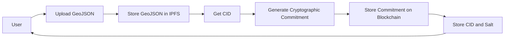
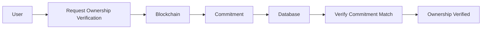

# 🏛️ Blockchain-Based Cadastral System with GIS & Decentralized Storage

> A blockchain-integrated land registry system combining Ethereum smart contracts, GIS mapping, and IPFS decentralized storage to create tamper-proof, transparent, and verifiable land ownership records.


---

## 📖 Overview

This project implements a **blockchain-based cadastral (land registry) system** that securely manages land ownership records using decentralized technologies.

It solves critical problems in traditional land registry systems:

- Record tampering
- Ownership disputes
- Lack of transparency
- Centralized database corruption risks
- Inefficient verification processes

The system integrates:

- **Ethereum Blockchain** → Immutable ownership commitments
- **IPFS** → Decentralized storage of land boundary GeoJSON
- **GIS Mapping (Leaflet.js)** → Visual parcel management
- **PostgreSQL** → Secure metadata and salt storage
- **MetaMask** → Blockchain authentication

---

## ✨ Key Features

- Immutable land ownership records using Ethereum smart contracts
- Decentralized storage of land boundaries using IPFS
- Cryptographic commitment-based ownership verification
- GIS-based interactive land parcel visualization
- MetaMask blockchain authentication
- Tamper-resistant and auditable system design
- Full audit trail using blockchain events
- Secure and verifiable ownership validation

---

## 🏗️ System Architecture

```mermaid
flowchart LR

    User[User / Land Owner]

    Frontend[Frontend Application<br>HTML, JS, Leaflet GIS]

    Backend[Backend Service<br>Node.js + Express API]

    Blockchain[(Ethereum Blockchain<br>Smart Contract)]

    IPFS[(IPFS Storage<br>GeoJSON Boundary Files)]

    Database[(PostgreSQL<br>Salt, CID, Metadata)]

    MetaMask[MetaMask Wallet]

    User --> Frontend

    Frontend --> MetaMask

    MetaMask --> Blockchain

    Frontend --> Backend

    Backend --> IPFS

    IPFS --> Backend

    Backend --> Database

    Backend --> Blockchain

    Blockchain --> Backend

    Backend --> Frontend
````

---

## ⚙️ Architecture Explanation

### Frontend Layer (GIS Interface)

Provides:

* Interactive map visualization
* Parcel boundary drawing
* Ownership dashboard
* Blockchain wallet connection

Technologies:

* HTML, CSS, JavaScript
* Leaflet.js GIS library
* ethers.js

---

### Authentication Layer (MetaMask)

Handles:

* User identity verification
* Blockchain wallet authentication
* Transaction signing

Ensures:

* Secure ownership verification
* Decentralized identity

---

### Backend Layer (Node.js + Express)

Responsibilities:

* API management
* IPFS file upload and retrieval
* Commitment generation
* Database management
* Smart contract interaction

Acts as:

* Middleware between frontend and blockchain/IPFS

---

### Blockchain Layer (Ethereum Smart Contract)

Stores:

* Ownership commitments
* Parcel registration records
* Immutable ownership proof

Provides:

* Tamper resistance
* Transparency
* Auditability

Smart contract:

```
CommitmentLandRegistry.sol
```

---

### Decentralized Storage Layer (IPFS)

Stores:

* GeoJSON land boundary files

Provides:

* Decentralized storage
* Tamper resistance
* Permanent data availability

Uses:

* Pinata IPFS pinning service

---

### Database Layer (PostgreSQL)

Stores:

* Parcel metadata
* IPFS CID references
* Salt values for commitment verification
* User data

Ensures:

* Efficient data retrieval
* Secure metadata management

---

## 🔄 Parcel Registration Flow



---

## 🔍 Ownership Verification Flow



---

## 🔐 Cryptographic Security Model

Commitment formula:

```
commitment = keccak256(owner_address + parcel_id + salt)
```

Ensures:

* Ownership privacy
* Tamper resistance
* Verifiable integrity

Uses:

* Keccak256 hashing
* Ethereum cryptographic security

---

## 🧱 Tech Stack

| Layer          | Technology            |
| -------------- | --------------------- |
| Frontend       | HTML, CSS, JavaScript |
| GIS            | Leaflet.js            |
| Backend        | Node.js, Express      |
| Blockchain     | Ethereum              |
| Smart Contract | Solidity              |
| Wallet         | MetaMask              |
| Storage        | IPFS                  |
| Database       | PostgreSQL            |
| Blockchain Dev | Truffle, Ganache      |
| Crypto         | Keccak256, ECDSA      |


---

## 🚀 Installation and Setup

### Prerequisites

* Node.js v18+
* PostgreSQL
* Ganache
* Truffle
* MetaMask

---

### Start Blockchain (Ganache)

```bash
ganache
```

---

### Deploy Smart Contract

```bash
cd blockchain
truffle migrate
```

---

### Start Backend

```bash
cd backend
npm install
npm start
```

---

### Start Frontend

```bash
cd frontend
live-server
```

---

## 🔐 Security Features

* Immutable blockchain storage
* Cryptographic ownership commitments
* Tamper-resistant decentralized storage
* Secure MetaMask authentication
* SQL injection prevention
* Input validation

---

## 🌍 Real-World Applications

* Government land registry systems
* Property ownership verification
* Banking loan collateral verification
* Legal land dispute resolution
* Real estate ownership validation

---

## 🔮 Future Enhancements

* Zero-Knowledge Proof ownership verification
* Ethereum mainnet deployment
* Multi-region IPFS redundancy
* Role-based authority access
* Full decentralization of backend

---

## 👨‍💻 Author

Vasan S P

GitHub: [https://github.com/vasan12sp](https://github.com/vasan12sp)

---

## 📄 License

MIT License

